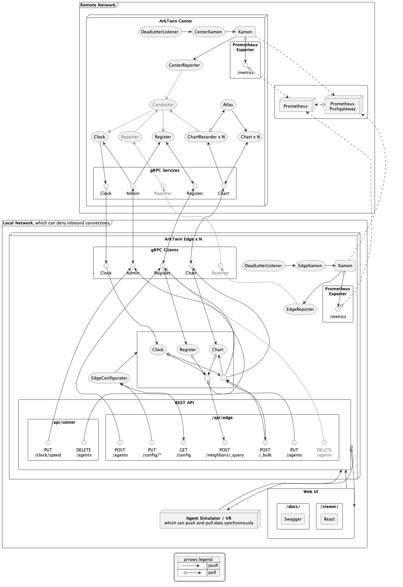
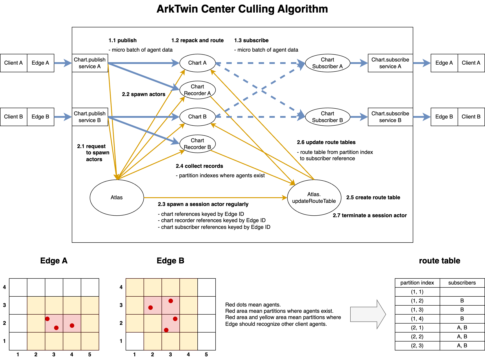

# ArkTwin: Distributed Multi-Agent Messaging Framework

[](https://github.com/arktwin/arktwin/actions/workflows/scala-ci.yaml)
[](https://scala-steward.org)

ArkTwin is a distributed messaging framework designed to connect various agent-based software, such as traffic simulators, pedestrian simulators, virtual camera video generators, virtual reality devices, etc.
Its primary applications are city-scale co-simulations and digital twins.

ArkTwin consists of two modules: Center and Edge.

- ArkTwin Center is a message broker equipped with network culling for handling a large number of agent transform messages.
- ArkTwin Edge is deployed as a sidecar for each agent-based software. It handles coordinate transformation and time correction, normalizing the spatiotemporal definitions across each simulator.

The communication protocol between ArkTwin Center and Edge is gRPC.
However, each agent-based software can connect to ArkTwin via local REST API provided by ArkTwin Edge, without managing stream control directly.

## Building

### Docker

1. `git checkout <release tag>`
1. `docker build -t arktwin-center -f docker/center.dockerfile .`
1. `docker build -t arktwin-edge -f docker/edge.dockerfile .`

### JAR

1. install Java Development Kit (recommended: [Eclipse Temurin 21 LTS](https://adoptium.net/temurin/releases/?variant=openjdk21&jvmVariant=hotspot))
1. install [sbt](https://www.scala-sbt.org/download)
1. install [Node.js](https://nodejs.org/en/download/package-manager) (recommended: v22)
1. `git checkout <release tag>`
1. `cd arktwin`
1. `sbt assembly`
1. pick up `arktwin-center.jar` from `center/target/scala-*.*.*/`
1. pick up `arktwin-edge.jar` from `edge/target/scala-*.*.*/`

## Running

### Docker

- `docker run [--network host | -p 2236:2236] [-v $(pwd)/center.conf:/etc/opt/arktwin/center.conf] arktwin-center  [arg]...`
- `docker run [--network host | -p 2237:2237] [-v $(pwd)/edge.conf:/etc/opt/arktwin/edge.conf] -e ARKTWIN_CENTER_STATIC_HOST=<CENTER_HOST> arktwin-edge`

### JAR

- `java [-Dconfig.file=center.conf] -XX:+UseZGC -XX:+ZGenerational -jar arktwin-center.jar`
- `ARKTWIN_CENTER_STATIC_HOST=<CENTER_HOST> java [-Dconfig.file=edge.conf] -XX:+UseZGC -XX:+ZGenerational -jar arktwin-edge.jar [arg]...`

### Edge Optional Command Arguments

ArkTwin Edge runs with auxiliary functions when the following optional command arguments are specified.

- `docs`: serve only `/docs/`
- `generate-openapi-center`: generate the OpenAPI yaml for `/api/center/` to stdout
- `generate-openapi-center <file>`: generate the OpenAPI yaml file for `/api/center/`
- `generate-openapi-edge`: generate the OpenAPI yaml for `/api/edge/` to stdout
- `generate-openapi-edge <file>`: generate the OpenAPI yaml file for `/api/edge/`

### Endpoints

The default endpoints for ArkTwin is as follows:

| Module | Role | Endpoint |
| --- | --- | --- |
| ArkTwin Center | gRPC Server | localhost:2236 |
| ArkTwin Center | Health Check | [localhost:2236/health](http://localhost:2236/health) |
| ArkTwin Center | Prometheus Exporter | [localhost:2236/metrics](http://localhost:2236/metrics) |
| ArkTwin Edge | REST API Server | localhost:2237/api/ |
| ArkTwin Edge | REST Docs | [localhost:2237/docs/](http://localhost:2237/docs/) |
| ArkTwin Edge | Health Check | [localhost:2237/health](http://localhost:2237/health) |
| ArkTwin Edge | Prometheus Exporter | [localhost:2237/metrics](http://localhost:2237/metrics) |
| ArkTwin Edge | Neighbors Viewer | [localhost:2237/viewer/](http://localhost:2237/viewer/) |

If you want to change the host and port settings, see [# Environment Variables](#environment-variables).

## Integrating

- Synchronize the clocks of all machines via NTP (Network Time Protocol)
- Run an ArkTwin Center
- Run your agent-based software
- Run an ArkTwin Edge as a sidecar of your agent-based software
- Configure your coordinate system and others in the ArkTwin Edge
```python
requests.post("http://localhost:2237/api/edge/config/coordinate", json=[
    "vector3": {"x": "East", "y": "North", "z": "Up", …},
    "rotation": {"EulerAnglesConfig": {"order": "XYZ", …}}
])
```
- Spawn your agents
- Register your agents in the ArkTwin Edge
```python
requests.post("http://localhost:2237/api/edge/agents", json=[
    {"agentIdPrefix": "alice", "kind": "human", …},
    {"agentIdPrefix": "bob",   "kind": "human", …}, 
…])
```
- Advance the clock of your agent-based software
- Update environment informations
- Simulate movement per agent
  - Recognize neighbors
  - Make decision
  - Move the agent
- Update transforms and statuses of your agents
- Send transforms and statuses and others of your agents to the ArkTwin Edge
```python
requests.put("http://localhost:2237/api/edge/agents", json={
  "timestamp": {"seconds": 1645536142, "nanos": 0},
  "transforms": {
    "alice-1": {"transform": {"localTranslation": {"x": 10, "y":20, "z":0.3}, …}, ...},
    "bob-a":   {"transform": {"localTranslation": {"x": 40, "y":50, "z":0.6}, …}, ...},
…}})
```
- Receive transforms and statuses of neighbors from the ArkTwin Edge 
```python
requests.post("http://localhost:2237/api/edge/nighbors/_query", json={
  "timestamp": {"seconds": 1645536142, "nanos": 0},
  "neighborsNumber": 100,
…})
```
- Update transforms and statuses of neighbors 
- Stop the ArkTwin Edge
- Stop your agent-based software

## Configuration

### Configuration Files

The default configuration files of ArkTwin are as follows.

- Center
  - [arktwin/center/src/main/resources/reference.conf](arktwin/center/src/main/resources/reference.conf)
  - [arktwin/center/src/main/resources/pekko.conf](arktwin/center/src/main/resources/pekko.conf)
  - [arktwin/center/src/main/resources/kamon.conf](arktwin/center/src/main/resources/kamon.conf)
- Edge
  - [arktwin/edge/src/main/resources/reference.conf](arktwin/edge/src/main/resources/reference.conf)
  - [arktwin/edge/src/main/resources/pekko.conf](arktwin/edge/src/main/resources/pekko.conf)
  - [arktwin/edge/src/main/resources/kamon.conf](arktwin/edge/src/main/resources/kamon.conf])

Any configuration can be overridden by specifying a file using the Java startup option `-Dconfig.file=path/to/config-file`.
The syntax of configuration files is [HOCON](https://github.com/lightbend/config/blob/main/HOCON.md) used in [Typesafe Config](https://github.com/lightbend/config).

### Environment Variables

Some configuration can be overridden using environment variables.

#### Center

| Environment Variable | Configuration Path | Default Value |
| --- | --- | --- |
| ARKTWIN_CENTER_PROMETHEUS_PUSHGATEWAY_API_URL | kamon.prometheus.pushgateway.api-url | http://localhost:9091/metrics/job/arktwin-center |
| ARKTWIN_CENTER_PROMETHEUS_PUSHGATEWAY_ENABLED | kamon.modules.pushgateway-reporter.enabled | false |
| ARKTWIN_CENTER_STATIC_HOST | arktwin.center.static.host | 0.0.0.0 |
| ARKTWIN_CENTER_STATIC_LOG_LEVEL | arktwin.center.static.log-level | info |
| ARKTWIN_CENTER_STATIC_LOG_LEVEL_COLOR | arktwin.center.static.log-level-color | true |
| ARKTWIN_CENTER_STATIC_PORT | arktwin.center.static.port | 2236 |
| ARKTWIN_CENTER_STATIC_PORT_AUTO_INCREMENT | arktwin.center.static.port-auto-increment | false |
| ARKTWIN_CENTER_STATIC_PORT_AUTO_INCREMENT_MAX | arktwin.center.static.port-auto-increment-max | 100 |
| ARKTWIN_CENTER_STATIC_RUN_ID_PREFIX | arktwin.center.static.run-id-prefix | run |

#### Edge

| Environment Variable | Configuration Path | Default Value |
| --- | --- | --- |
| ARKTWIN_CENTER_STATIC_HOST | pekko.grpc.client.arktwin.host | 127.0.0.1 |
| ARKTWIN_CENTER_STATIC_PORT | pekko.grpc.client.arktwin.port  | 2236 |
| ARKTWIN_EDGE_PROMETHEUS_PUSHGATEWAY_API_URL | kamon.prometheus.pushgateway.api-url | http://localhost:9091/metrics/job/arktwin-edge |
| ARKTWIN_EDGE_PROMETHEUS_PUSHGATEWAY_ENABLED | kamon.modules.pushgateway-reporter.enabled | false |
| ARKTWIN_EDGE_STATIC_EDGE_ID_PREFIX | arktwin.edge.static.edgeIdPrefix | edge |
| ARKTWIN_EDGE_STATIC_HOST | arktwin.edge.static.host | 0.0.0.0 |
| ARKTWIN_EDGE_STATIC_LOG_LEVEL | arktwin.edge.static.log-level | info |
| ARKTWIN_EDGE_STATIC_LOG_LEVEL_COLOR | arktwin.edge.static.log-level-color | true |
| ARKTWIN_EDGE_STATIC_PORT | arktwin.edge.static.port | 2237 |
| ARKTWIN_EDGE_STATIC_PORT_AUTO_INCREMENT | arktwin.edge.static.port-auto-increment | true |
| ARKTWIN_EDGE_STATIC_PORT_AUTO_INCREMENT_MAX | arktwin.edge.static.port-auto-increment-max | 100 |

## REST API

- https://arktwin.github.io/arktwin/swagger-ui/center/
- https://arktwin.github.io/arktwin/swagger-ui/edge/

## Metrics for Prometheus

- Chart metrics
  - arktwin_edge_chart_1_publish_agent_num {edge_id, run_id}
  - arktwin_edge_chart_1_publish_batch_num {edge_id, run_id}
  - arktwin_edge_chart_1_publish_from_put_machine_latency {edge_id, run_id}
  - arktwin_center_chart_2_publish_agent_num {edge_id, run_id}
  - arktwin_center_chart_2_publish_batch_num {edge_id, run_id}
  - arktwin_center_chart_2_publish_from_edge_machine_latency {edge_id, run_id}
  - arktwin_center_chart_3_route_agent_num {edge_id, run_id}
  - arktwin_center_chart_3_route_batch_num {edge_id, run_id}
  - arktwin_center_chart_3_route_machine_from_publish_machine_latency {edge_id, run_id}
  - arktwin_center_chart_4_subscribe_agent_num {edge_id, run_id}
  - arktwin_center_chart_4_subscribe_batch_num {edge_id, run_id}
  - arktwin_center_chart_4_subscribe_from_route_machine_latency {edge_id, run_id}
  - arktwin_edge_chart_5_subscribe_agent_num {edge_id, run_id}
  - arktwin_edge_chart_5_subscribe_from_center_machine_latency {edge_id, run_id}
- REST API metrics
  - arktwin_edge_rest_agent_num {endpoint, edge_id, run_id}
  - arktwin_edge_rest_request_num {endpoint, edge_id, run_id}
  - arktwin_edge_rest_process_machine_time {endpoint, edge_id, run_id}
  - arktwin_edge_rest_simulation_latency {endpoint, edge_id, run_id}
- Other metrics
  - arktwin_center_dead_letter_num {recipient, edge_id, run_id}
  - arktwin_edge_dead_letter_num {recipient, edge_id, run_id}

## Messaging

### Messaging Architecture



Gray elements are not implemented.

### Messaging Control

To control messaging, there are following configurations:

- Buffer size of Pekko Streams (e.g., `arktwin.center.static.subscribe-buffer-size`).
- Mailbox of Pekko Typed Actors (e.g., `pekko.actor.typed.mailbox.arktwin.center.actors.Atlas`).

The default settings for mailboxes are defined by the following rules:

- Actors exchanging transform data use bounded mailboxes. They have strong at-most-once delivery property because transform data is exchanged in large volumes at high frequency.
- Actors in `arktwin.edge.actors.sinks` use control-aware mailboxes.
- Others use `org.apache.pekko.dispatch.SingleConsumerOnlyUnboundedMailbox` as the default mailbox for Pekko Typed Actors.

For more details on mailboxes, see [Pekko Mailboxes documentation](https://pekko.apache.org/docs/pekko/current/typed/mailboxes.html).

### Center Culling Algorithm



## Publications

- Akira Yoshioka, Takatomo Torigoe, Naoki Akiyama, Hideki Fujii, Takashi Machida, Satoru Nakanishi, Takayoshi Yoshimura. ArkTwin: Distributed Heterogeneous Multi-Agent Simulation Platform. [Multimedia, Distributed, Cooperative, and Mobile Symposium 2024 (in Japanese)](https://www.dicomo.org/2024/). (awarded first prize at the Noguchi Awards)

## Contributing

Pull requests for bug fixes and feature development are very welcome.
Your contributions are more acceptable if you start a conversation in [Discussions](https://github.com/arktwin/arktwin/discussions) or [Issues](https://github.com/arktwin/arktwin/issues).

We are especially interested in your ideas and examples for using ArkTwin.
Please feel free to share them in [Show and tell](https://github.com/arktwin/arktwin/discussions/categories/show-and-tell).

## License

ArkTwin is licensed under the [Apache License, Version 2.0](https://www.apache.org/licenses/LICENSE-2.0).

Copyright 2024 TOYOTA MOTOR CORPORATION
